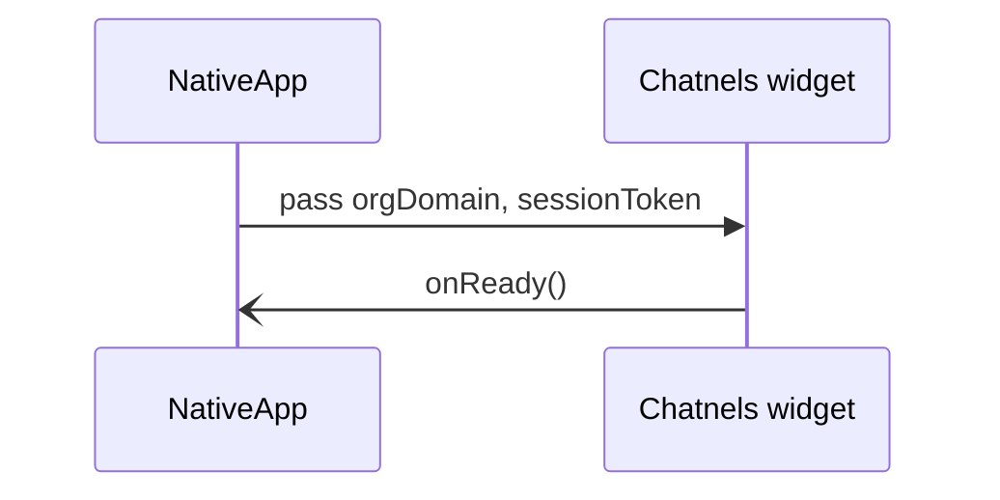
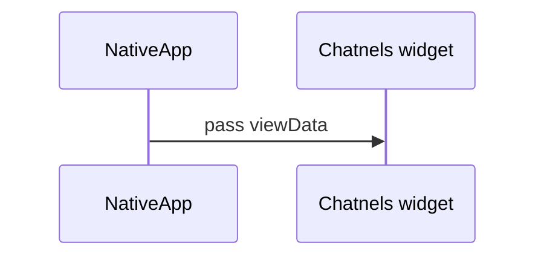
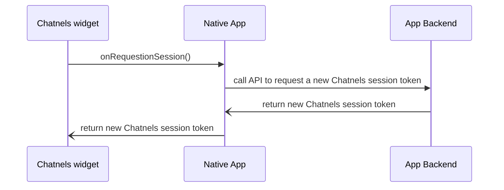

# Flow Diagrams for native app chatnels widget integration

## Initialization Diagram
pass orgDomain and sessionToken to initialize Chatnels embed and pre-load all the files.

## Change view Diagram
pass a new viewData config to change the current Chatnels embed view to chat or bot flowchart

## Request New Session Diagram
How to request a new Chatnels token

